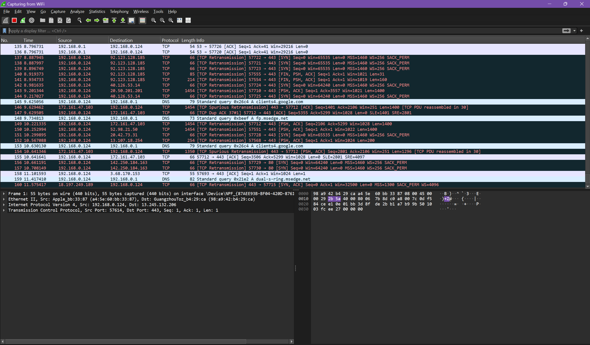
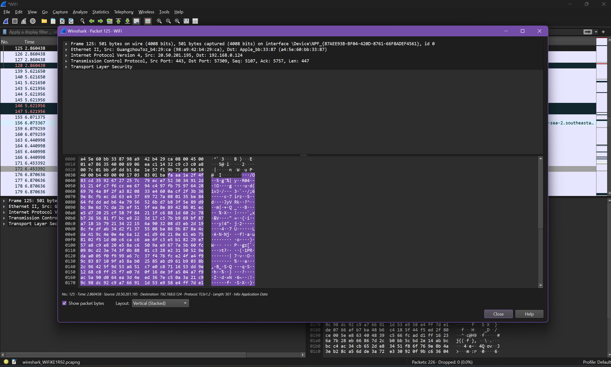

# Wireshark Traffic Analysis

## Overview
Analyzing captured network traffic to detect suspicious activity.

## Tools Used
- Wireshark
- Kali Linux
- PCAP files

## Steps Taken
1. Captured network traffic using Wireshark.
2. Filtered HTTP, DNS, and suspicious traffic.
3. Identified potential malicious connections.
4. Extracted credentials from unencrypted HTTP traffic.

## Screenshots

## Results
- Detected HTTP passwords in plaintext.
- Found suspicious outbound IP traffic.

## References
- [Wireshark Filters](https://wiki.wireshark.org/DisplayFilters)
- [Wireshark User Guide](https://www.wireshark.org/docs/)
